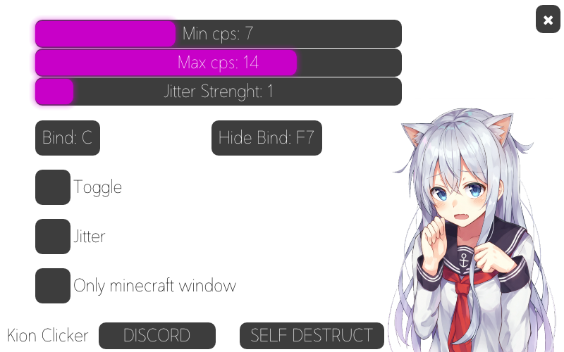

<h1>Kion clicker</h1>

<h2>История создания</h2>

Изначально кликер задумывался как коммерческий проект, но конкуренция на рынке полностью убивает смысл в любом платном автокликере.  
Почему? На рынке полно полностью бесплатных автокликеров, которые в главном функционале (кликать) ничем не отличаются от планых. Так же стоит отметить, что практически у любой мыши есть свой софт, для написания макросов. Этот софт будет лучше 99% автокликеров, так как все его нажатия эмулируются на уровне мыши, что позволяет обходить любые анти-читы.

<h2>Функционал</h2>

На момент публикации без проблем обходит Lunar client. Так же работает для Bedrock версии игры.

<ol>
    <li><b>Рандомизация:</b> в этой версии была обновлена рандомизация. В большинстве кликеров рандомизация привязана к кликам, что делает её крайне плоской. В кион кликере рандомизация выведена в отдельный поток, что практически доводит её до идеала.</li>
    <li><b>Джиттер: </b>джиттер так же выведен в отдельный поток, что позвоялет убрать зависимость от кликов.</li>
    <li><b>Кликать только в окне игры:</b> если использовать стороние клиенты для игры (например lunar), то скорее всего работать не будет.</li>
    <li><b>Спрятать окно кликера:</b> позволяет прятать окно клиера, для игры на демку и т.д.</li>
    <li><b>Самоуничтожение:</b> в теории должен подчищать все логи запуска, и т.д.</li>
</ol>

<h2>Заключение</h2>

Вы можете использовать этот автокликер полностью бесплатно. Или адаптировать его исходный код для своего кликера. Этот код был написан давно, так что в нём может быть полно ошибок!
